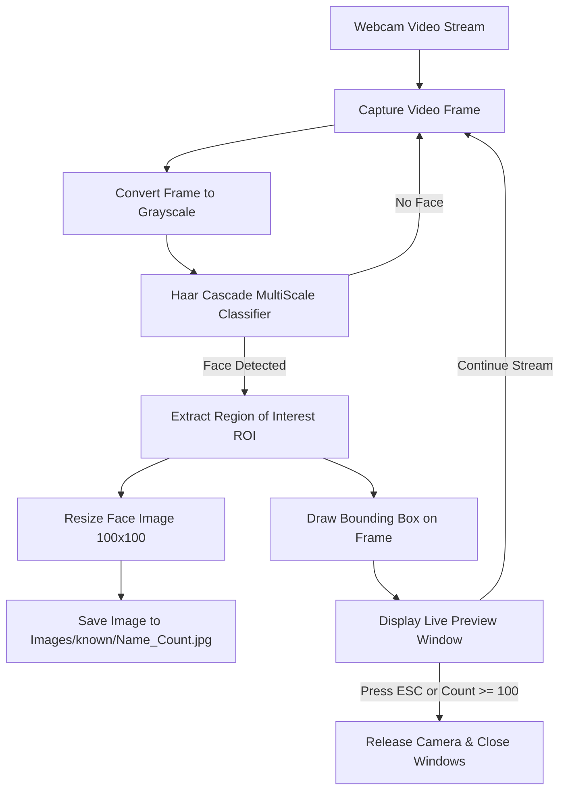

# 👤 Face Tracing and Recognition using Haar Cascade

[](https://www.python.org/)
[](https://opencv.org/)
[](https://numpy.org/)
[](LICENSE)
[](#)

A real-time Computer Vision system designed for **face detection**, **face tracing**, and **automated dataset sampling** from live camera feeds using OpenCV's Haar Feature-based Cascade Classifiers. This project also serves as a baseline for facial verification systems, with branches integrating modern deep learning architectures such as **FaceNet** and **DeepFace (VGG-Face)**.

---

## 📑 Table of Contents
- [Key Features](#-key-features)
- [System Architecture](#-system-architecture)
- [Directory Structure](#-directory-structure)
- [Prerequisites & Installation](#-prerequisites--installation)
- [How to Use](#-how-to-use)
  - [1. Dataset Collection (`cascade.py`)](#1-dataset-collection-cascadepy)
  - [2. Recognition Pipeline (`main.py`)](#2-recognition-pipeline-mainpy)
- [Haar Cascade Detection Parameters Explained](#-haar-cascade-detection-parameters-explained)
- [Experimental & Feature Branches](#-experimental--feature-branches)
- [Troubleshooting & FAQs](#-troubleshooting--faqs)
- [Future Roadmap](#-future-roadmap)
- [License](#-license)

---

## 🚀 Key Features

- ⚡ **Real-Time Face Detection**: Utilizes OpenCV's pre-trained frontal face Haar Cascade (`haarcascade_frontalface_default.xml`) for ultra-fast, low-latency face tracking on live webcam streams.
- 🎯 **Automated Facial Dataset Sampling**: Automatically crops, normalizes, and resizes detected faces to a standardized dimension (100×100 px or 224×224 px) and saves them with custom user labels.
- 🔄 **Dynamic Bounding Box Visualization**: Draws instant bounding boxes around detected faces in live frames with real-time feedback.
- 📦 **Extensible Architecture**: Clean baseline that supports integration with deep learning embeddings (`FaceNet`, `DeepFace`, `dlib`, `face_recognition`).
- 🛑 **Graceful Stream Termination**: Built-in keyboard interrupts (`ESC` key) and configurable sample limit thresholds (e.g., 100 frames).

---

## 📐 System Architecture



---

## 📁 Directory Structure

```plaintext
Face-Tracing-and-recognition-using-Haar-cascade/
│
├── Images/                               # Directory containing training & runtime images
│   ├── .gitkeep                          # Tracks empty folder in git
│   └── known/                            # (Generated) User-specific face datasets
│
├── cascade.py                            # Face detection & dataset image capture script
├── haarcascade_frontalface_default.xml   # Pre-trained Haar Cascade model for frontal face detection
├── main.py                               # Application entrypoint & recognition module
├── requirements.txt                      # Project dependencies
├── .gitignore                            # Excludes dataset images and cache files
└── README.md                             # Comprehensive project documentation
```

---

## 💻 Prerequisites & Installation

### 1. Prerequisites
- **Python 3.8 to 3.11** installed on your system. Verify by running:
  ```bash
  python --version
  ```
- A functional **webcam** (built-in laptop webcam or external USB camera).

### 2. Clone the Repository
```bash
git clone https://github.com/advait-kale/Face-Tracing-and-recognition-using-Haar-cascade.git
cd Face-Tracing-and-recognition-using-Haar-cascade
```

### 3. Create & Activate a Virtual Environment

- **Windows (PowerShell)**:
  ```powershell
  python -m venv venv
  .\venv\Scripts\Activate.ps1
  ```
- **Windows (Command Prompt)**:
  ```cmd
  python -m venv venv
  .\venv\Scripts\activate.bat
  ```
- **macOS / Linux**:
  ```bash
  python3 -m venv venv
  source venv/bin/activate
  ```

### 4. Install Dependencies
```bash
pip install -r requirements.txt
```

> **Note**: If `requirements.txt` is not used, install directly via:
> ```bash
> pip install opencv-python numpy
> ```

---

## 🕹️ How to Use

### 1. Dataset Collection (`cascade.py`)

The [`cascade.py`](cascade.py) script opens your webcam, identifies the user's face using the Haar Cascade model, extracts the face bounding box, and saves a set of normalized grayscale images.

```bash
python cascade.py
```

#### Workflow:
1. When prompted, type `1` to run.
2. Enter the subject's name (e.g., `Advait`).
3. The camera window will appear with a blue bounding box around your face.
4. The system will capture face samples and save them into the `Images/known/` folder formatted as `{name}_{count}.jpg`.
5. The capture stops automatically after reaching **100 images**, or immediately when you press the **`ESC`** key (ASCII `27`).

> [!TIP]
> **Path Recommendation**: Ensure relative path resolution is used for portability across different machines:
> ```python
> import os
> BASE_DIR = os.path.dirname(os.path.abspath(__file__))
> CASCADE_PATH = os.path.join(BASE_DIR, "haarcascade_frontalface_default.xml")
> SAVE_DIR = os.path.join(BASE_DIR, "Images", "known")
> ```

---

### 2. Recognition Pipeline (`main.py`)

[`main.py`](main.py) provides the framework for loading saved face profiles, extracting facial embeddings, and matching incoming live video frames against known identities.

```bash
python main.py
```

---

## 🔬 Haar Cascade Detection Parameters Explained

In [`cascade.py`](cascade.py), face detection is controlled by `detectMultiScale`:

```python
faces = face_cascade.detectMultiScale(
    gray,
    scaleFactor=1.3,
    minNeighbors=5,
    minSize=(30, 30)
)
```

| Parameter | Recommended Value | What it Does |
| :--- | :--- | :--- |
| `scaleFactor` | `1.1` – `1.3` | Compensates for faces appearing closer or further away from the camera. A smaller value (e.g., `1.1`) is slower but more sensitive; higher values (e.g., `1.3`) are faster. |
| `minNeighbors` | `4` – `6` | Specifies how many neighboring candidate rectangles must retain a face to confirm detection. Higher values eliminate false positives; lower values detect subtle faces. |
| `minSize` | `(30, 30)` | Smallest possible face size in pixels to consider. Ignores small background noise or false artifacts. |

---

## 🌿 Experimental & Feature Branches

This repository features multiple research and development branches exploring higher-accuracy recognition methods:

- **`main`**: Baseline Haar Cascade face tracking and automated image capture tool.
- **`deepface_approch`**: Facial verification utilizing `DeepFace` with the **VGG-Face** model and **cosine distance** metrics for one-to-many face comparison.
- **`Facenet`**: Lightweight 128/512-dimensional face embedding extraction using Google FaceNet for high-accuracy verification.
- **`gpt_analyse_img`**: Real-time optimization experiments to eliminate processing latency between frame capture and deep face verification.

To switch and test an experimental branch:
```bash
git checkout Facenet
# or
git checkout deepface_approch
```

---

## 🛠️ Troubleshooting & FAQs

### 1. `cv2.error: OpenCV(4.x.x) ... CascadeClassifier::detectMultiScale`
- **Cause**: The path to `haarcascade_frontalface_default.xml` is incorrect or missing.
- **Solution**: Verify the XML file is in the project root and load it with an absolute or dynamic relative path using `os.path.join(os.path.dirname(__file__), "haarcascade_frontalface_default.xml")`.

### 2. `cap.read() returns None / Camera does not open`
- **Cause**: Webcam is in use by another application or the index is incorrect.
- **Solution**:
  - Close other apps using your webcam (Zoom, Teams, Discord, etc.).
  - Change `cv2.VideoCapture(0)` to index `1` or `2` if using an external USB camera.

### 3. False Positives / Poor Face Tracking
- **Lighting**: Ensure adequate and balanced lighting on the face (avoid harsh backlighting).
- **Tuning**: Increase `minNeighbors` from `3` to `5` or `6` in `detectMultiScale`.
- **Angles**: The standard frontal cascade operates best when faces are oriented within ~30 degrees of frontal view.

---

## 🗺️ Future Roadmap

- [ ] **Graphical User Interface (GUI)**: Implement Tkinter or PyQt interface with buttons for easy capture and recognition control.
- [ ] **Embedding Cache**: Cache face embeddings (`.npy` / SQLite) to avoid re-extracting features on every startup.
- [ ] **Multi-Face Recognition**: Identify multiple individuals simultaneously within the same frame.
- [ ] **Anti-Spoofing / Liveness Check**: Integrate blink detection or landmark motion via MediaPipe / dlib to prevent photo spoofing.

---

## 📄 License

This project is licensed under the [MIT License](LICENSE) - feel free to modify and use it for educational and personal projects.

---

<p align="center">
  Developed by <a href="https://github.com/advait-kale">Advait Kale</a>
</p>
